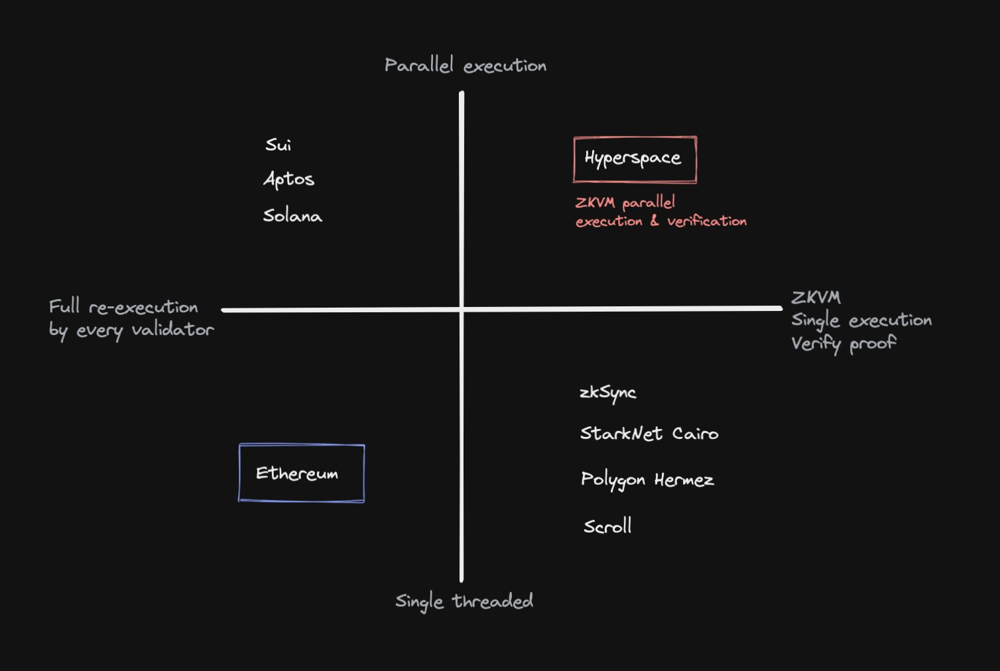

# Blockchains based on their type of execution

Image source: [Introducing Hyperspace Article](https://mirror.xyz/0xdC5d2d95CD48865b9d8d9b44827A4a85a65f2970/Rg1ietH8lFbzS3wwl6bnfOCdOoXvKMm3yZGFzSLc6EY)

## [Ethereum](https://ethereum.org/es/)
I think it does not require a description :smile:

## [Solana](https://solana.com/es)
Solana is a blockchain platform designed to host decentralized, scalable applications. It can process many more transactions per second and charges lower transaction fees than rival blockchains (like Ethereum). 
Solana is a proof-of-stake (PoS) blockchain but improves on it with a mechanism called [proof-of-history (PoH)](https://solana.com/news/proof-of-history), which uses hashed timestamps to verify when transactions occur.

## [Polygon Hermez / Polygon zkEVM](https://polygon.technology/solutions/polygon-hermez/)
Ethereum Layer-2 ZK-rollup solution that leverages the scaling power of zero-knowledge proofs while maintaining Ethereum compatibility.

## [Aptos](https://aptoslabs.com/)
Aptos is a newly constructed proof-of-stake (PoS) blockchain that aims to alleviate the L1 market’s regular scalability and security concerns. The Aptos blockchain, according to the whitepaper, was “designed with scalability, safety, consistency, and upgradeability as guiding principles.”

* Programming language: [Move](https://github.com/diem/move) (Rust-based, designed by Diem)
* Consensus: PoS
* Prioritizes heterogeneous validators (constrained CPU and storage)

## [SUI](https://sui.io/)
SUI is a permissionless PoS L1 blockchain, created by [Mysten Labs](https://mystenlabs.com/). Sui’s object-centric architecture provides horizontal scalability, that it claims is vital to capturing the next billions Web3 users. Sui allows causally unrelated transactions to build a parallelized agreement, increasing scalability. 

* Programming language: [Move](https://github.com/diem/move) (Rust-based, designed by Diem)
* Consensus: PoS
* Sui plans to shard data storage efficiently, and scale its resources horizontally.

## [zkSync](https://zksync.io/)
Created by [Matter Labs](https://matter-labs.io/), zkSync is one of the most anticipated zkEVM projects. Boasting 2,000 transactions per second, a 10-minute processing time between the rollup and Ethereum mainnet, and no upper bound limit to the value the rollup can securely handle. zkSync adopts the Type-4 approach, supporting compatibility with Solidity and Vyper, Ethereum's coding languages. zkSync 1.0 is already live, having processed about four million transactions. EVM-compatible ZK rollup powered by a zkEVM.

## [Starknet Cairo](https://starkware.co/starknet/)
While most zkEVM projects use [ZK-SNARKs](https://github.com/matter-labs/awesome-zero-knowledge-proofs), Starkware's StarkNET adopts [ZK-STARKs](https://github.com/matter-labs/awesome-zero-knowledge-proofs), which are more secure than ZK-SNARKs in theory but require more gas, take longer to verify, and occupy more block space. StarkNET 

## [Scroll](https://scroll.io/)
Scroll is a zkEVM-based zkRollup on Ethereum that enables native compatibility for existing Ethereum applications and tools. 
Scroll processes transactions off-chain, and posts succinct proofs of correctness on-chain. 

## [Hyperspace](https://hyperspace.foundation/)
On January 24th, 2023, a group of people collectively known simply as Gutenberg announced Hyperspace, a new type of a supercomputer powered by an entirely browser-based blockchain.

"Hyperspace utilizes the user’s own browser in a new web zkVM to execute smart contracts and capture the Proof of Execution Trace in a STARK. These STARKs (“actions”) are bundled together into a single SNARK transaction which is propagated through the network. This design enables massively parallel execution. Since it is already known which specific states are impacted, this then plays a pivotal role in parallel validation. Overall, this design enables 10ms-50ms pre-L1-finality in the same region, providing an experience even faster than what was known as web2 and enabling new type of web3 multiplayer use cases." -- [from Introduciong Hyperspace Article](https://mirror.xyz/0xdC5d2d95CD48865b9d8d9b44827A4a85a65f2970/Rg1ietH8lFbzS3wwl6bnfOCdOoXvKMm3yZGFzSLc6EY)

---

# References Links

- [Aptos vs SUI blockchain: Which one is better Layer 1 Blockchain?](https://cryptobullsclub.com/aptos-vs-sui-blockchain/)
- [Aptos vs Sui Blockchain: Similarities and Differences](https://boxmining.com/aptos-vs-sui/)
- [zkEVMs – Everything you need to know](https://blog.pantherprotocol.io/what-is-a-zkevm-heres-everything-you-need-to-know/)
- [Estado de la escalabilidad en Ethereum](https://www.defilatam.com/blog/estado-de-la-escalabilidad-en-ethereum-zk-rollups)
- [Introducing Hyperspace - a new type of a supercomputer](https://mirror.xyz/0xdC5d2d95CD48865b9d8d9b44827A4a85a65f2970/Rg1ietH8lFbzS3wwl6bnfOCdOoXvKMm3yZGFzSLc6EY)
- [What is Polygon zkEVM](https://wiki.polygon.technology/docs/home/polygon-basics/zkEVM-basics/#:~:text=Polygon%20zkEVM%20is%20a%20Layer,higher%20throughput%20and%20lower%20fees.)